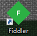

赛事星题目解析脚本

## Getter

如何获取json文件?

我们可以通过Charles或者Fidder抓包工具对题目的json文件进行抓包

最后再保存JSON文件到与脚本同一的文件目录就好了就好了！

## Usage

输入json文件的名称，这里再统一目录下的json文件名称叫: 测试

再输入想要输出的赛事星的题目的单文件名称:

## Notes

该脚本只能用于对赛事星的题目解析，对于其他平台的题目解析将失效.